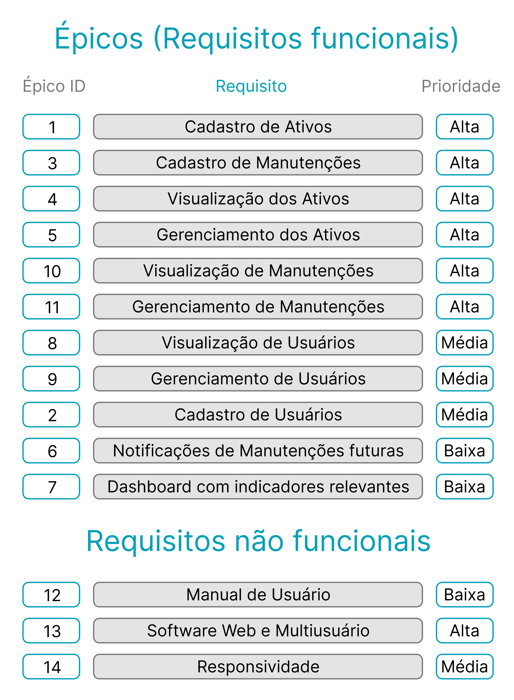
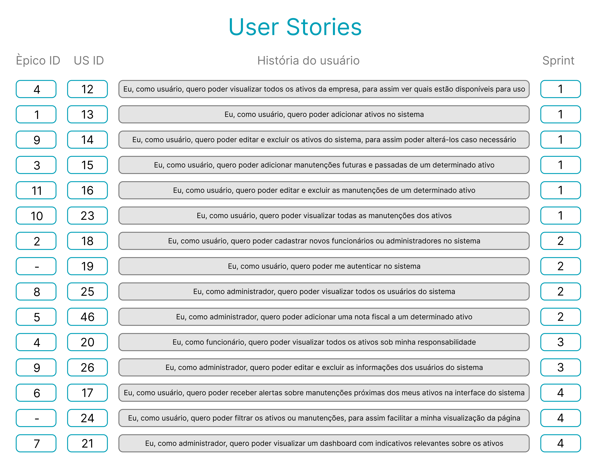
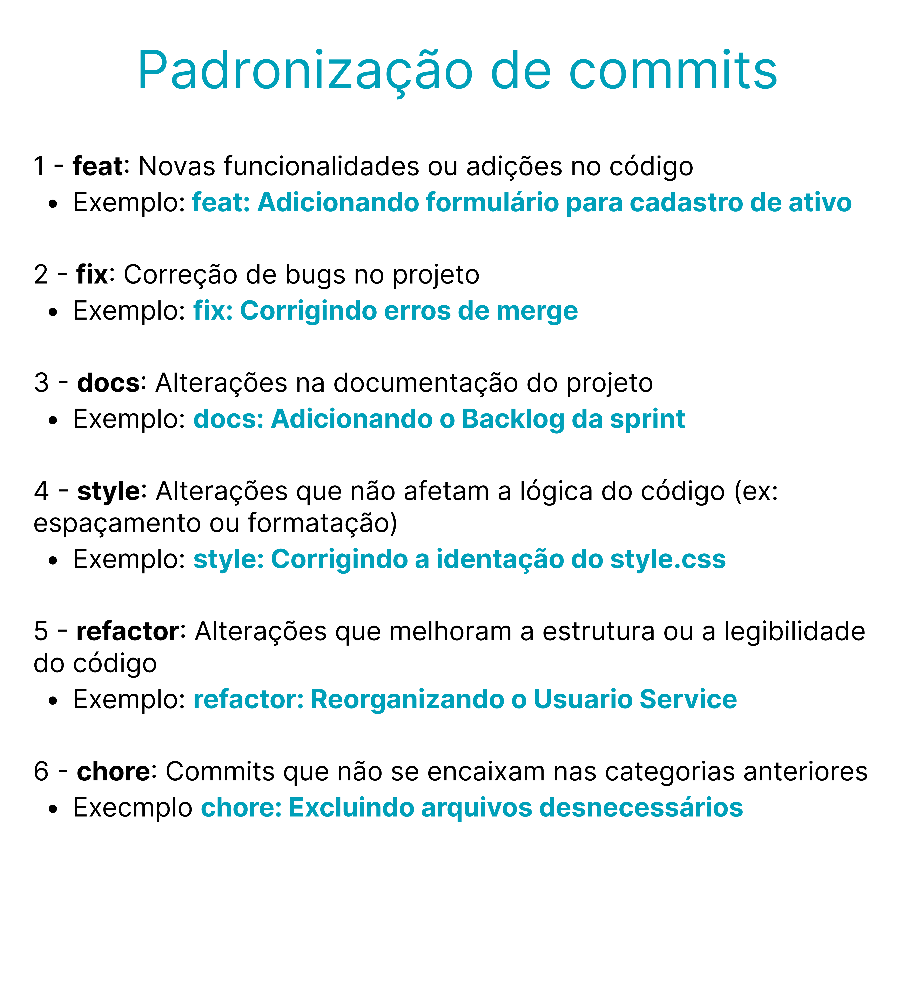

<!-- Para melhor visualização do código, tire a quebra de linha automatica. -->
 

<h1> FATEC Profº Jessen Vidal - São José dos Campos - 3º Semestre DSM </h1>

    
<h2> 📑 Sobre o Projeto </h2>
Projeto desenvolvido para a API (Aprendizagem por Projeto Integrado) do 3° semestre de Desenvolvimento de Software Multiplataforma (DSM). O objetivo do projeto é o desenvlvimento de uma solução para o gerenciamento de ativos de uma empresa. A plataforma deve conter informações detalhadas sobre ativos, cadastro e histórico de manutenções dos ativos e dashboard com indicativos relevantes sobre os ativos.

 

<h3> 📌 Status do projeto: Em progresso ⏳ </h3>

 

    
<h3> :robot: Tecnologias utilizadas até o momento: </h3>

    
    
    
    
    
    
    
    
    

    

 

<!-- <h2> 🎯 MVP </h2> -->

 

    
<h2> 🚩 Sprints </h2>

<table >
    <tr>
        <th> Sprint </th>
        <th> Início </th>
        <th> Entrega </th>
        <th> Relatório </th>
        <th> Status </th>
    </tr>
    <tr align="center">
        <td> 1 </td>
        <td> 25/04 </td>
        <td> 14/04 </td>
        <td> <a href="https://github.com/Equipe-CodeLand/API-2024.1/wiki/API%E2%80%902024.1-%E2%80%90-Sprint-1">Acesse!</a></td>
        <td> Finalizada </td>
    </tr>
     <tr align="center">
        <td> 2 </td>
        <td> 15/04 </td>
        <td> 05/05 </td>
        <td> 🚧 </td>
        <td> Em andamento </td>
    </tr>
     <tr align="center">
        <td> 3 </td>
        <td> 06/05 </td>
        <td> 26/05 </td>
        <td> 🚧 </td>
        <td> - </td>
    </tr>
     <tr align="center">
        <td> 4 </td>
        <td> 27/05 </td>
        <td> 16/06 </td>
        <td> 🚧 </td>
        <td> - </td>
    </tr>
</table>

 

    
<h2> 📜 Backlog Total </h2>
<h3> Épicos (Requisitos Funcionais) </h3>
 
<h3> User Stories </h3>

 

<h2> DoR e DoD </h2>
<table>
    <tr>
        <th> DoR </th>
        <th> DoD </th>
    </tr>
    <tr> 
        <td> Prototipar a funcionalidade em um wireframe, para auxilio do Dev Team </td>
        <td> Cumprir claramente os critérios de aceitação previstos </td>
    </tr>
    <tr>
        <td> User Stories com descrição dos objetivos e critérios de aceitação </td>
        <td> Testes para garantir que a tarefa realmente cumpre sua função com êxito </td>
    </tr>
    <tr>
        <td> Planning Poker para estimativa de esforço e prazo de entrega </td>
        <td> Apresentar um código limpo para simplificar manutenções e adições futuras </td>
    </tr>
    
</table>

<h2> Padrão de commit </h2>

<h2> 👨‍💻 Equipe </h2>
    
<table>
    <tr>
        <th> Foto </th>
        <th> Função </th>
        <th> Nome </th>
        <th> Linkedin </th>
        <th> Git Hub </th>
    </tr>
    <tr>
          <td>  </td>
          <td> Scrum Master </td>
          <td> Pedro Henrique de Souza </td>
          <td>  </td>
          <td>  </td>
      </tr>
    <tr>
        <td> </td>
        <td> Product Owner </td>
        <td> Felipe Gabriel Vieira </td>
        <td>  </td>
        <td>  </td>
    </tr>
  <tr>
        <td>  </td>
        <td> Dev Team </td>
        <td> Iago Cardoso Souza </td>
        <td>  </td>
        <td>  </td>
    </tr>
    <tr>
        <td>  </td>
        <td> Dev Team </td>
        <td> Laura Gabriel Gonçalves </td>
        <td>  </td>
        <td>  </td>
    </tr>
  <tr>
     <td>  </td>
          <td> Dev Team </td>
          <td> Letícia Helena de Oliveira Carvalho </td>
          <td>  </td>
    <td>  </td>
    </tr>
  </tr>
    <tr>
        <td>  </td>
        <td> Dev Team </td>
        <td> Livia Alves de Faria </td>
        <td>  </td>
        <td>  </td>
    </tr>
    <tr>
        <td>  </td>
        <td> Dev Team </td>
        <td> Luiz Felipe dos Santos </td>
        <td>  </td>
        <td>  </td>
    </tr>
</table>
    
 

<a href="#topo">[Voltar ao topo]</a>
